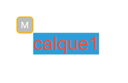

# sketch-2-print v0.8.2

**Sketch-2-print** vise à être une application web permettant d'utiliser à la fois la librairie **paged.js** pour les fonctionnalités de mise en page et l'option de télécharger un document pdf prêt pour l'impression, et tout autre librairies javascript, ou API, susceptible d'intervenir dans un espace de travail pour objets imprimés, comme **p5.js** pour générer du contenu graphique, **D3.js** pour manipuler des set de données complexes et matérialisable, **rythme.js** pour faire de l'édition d'un livre un jeu de rythme, une expérience musicales, etc.

### En Réseau

J'ai comme projet d'utiliser [Tangle (WASM)](https://github.com/kettle11/tangle) pour permettre la collaboratin instanté en ligne sur un même document de travail.

### Aperçu au 07.03.23

.png)
.png)
.png)


Dans l'état actuel des choses, le site est pensé pour la gestion d'un document d'une seule et unique page d'un format prédéfini.
Cela ne veut pas dire qu'il n'est pas en projet d'exploiter la capacité inhérente à paged.js de créer un document à plusieurs pages, avec un format à définir dans une boite de dialogue précédant l'interface principale, mais cela n'arrivera pas avant la 1.0 ou la 1.1.

Les dimensions prédéfinis sont les formats standard ISO **A5, A4, A3, A2 et A1**. 

Cependant paged.js ne fait pas de gestion de cadrage dans le cas où les dimensions deviennent plus grande que la hauteur de l'écran utilisé. Ce problème intervient dès le format A4.

(il doit être possible de faire quelque chose de plus propre que la formule ci-dessous car le facteur d'agrandissement entre le format A5 vers A4 est égale à celui entre A4 et A3 et ainsi de suite, 1.4141..., donc j'ai cherché à créer une objet avec pour chaque valeur de taille de document, un facteur d'agrandissement qui suivrait une augmentation linéaire ce qui est presque le cas mais pas tout à fait). 

Une fois le calcul fait, la fonction CSS **scale()** récupère et applique cette valeur, l'intègre dans une variable elle même placée dans une chaine de caractères utilisé pour écrire une nouvelle balise style ajouté dans le head du document de travail. 

```JavaScript
const paperScalingRatio = {
    A5: 0.5,
    A4: 1.4,
    A3: 2.2,
    A2: 3.1,
    A1: 4,
}

let pageRatio;
let scaleCSS;

let first_page;
function getPageInfo() {
    pageRatio = Math.pow((0.68), paperScalingRatio["A3"]);
    scaleCSS = ".pageScale{ transform: scale(" + pageRatio + ") }"

    first_page = document.querySelector(".pagedjs_first_page");

    let newScaleStyle = document.createElement("style");
    newScaleStyle.innerHTML = scaleCSS;
    document.head.appendChild(newScaleStyle)

    first_page.classList.add("pageScale");
}
```
Attention ! Pour que le scale soit bien appliqué, il faut préciser en amont que le document qui subira ce scaling soit transformé depuis le correct point d'ancrage, un point situé en haut à gauche de l'objet cible.
La ligne suivante permets très grossièrement de placer le centre vertical du document au centre vertical de l'écran. 

```CSS
.pagedjs_first_page {
    transform-origin: top left;
    margin-left: calc(50vw - 230px);    
}
```


### Gestion des objets avec interface HTML

Paged.js, au chargement, écrase tout le contenu du body pour appliquer avec soin tous les paramètres nécessaires à l'affichage du document. Il est donc impossible (ou je ne sais pas comment faire) de **"hardcoder"** une interface HTML dans le document de travail.
Je décide de passer par un second document, pour l'instant nommé **global_interface**.
Un autre ensemble de fichiers html, css et js concentrés sur la création et la manipulation des futurs éléments affichés et modifiables.
Heuresement pour moi, les requêtes XML, que j'emploie avec l'**API Fetch**, peuvent parfaitement récupérer des données textes du format .html ou .css .

```javascript
function getGUI(){
    fetch('./_global_interface/index.html')
        .then(response => {
            return response.text();
        }).then(html => {
            let htmlContent = html;
            fetch('./_global_interface/global_ui.css')
                .then(response => {
                    return response.text()
                }).then(css => {
                    let cssContent = css;
                    displayInterface(htmlContent, cssContent)
                })
            })
}

function displayInterface(html, css) {

    let htmlContent = document.createElement("div")
    htmlContent.innerHTML = html;

    let interfaceHtml = htmlContent.querySelector("#global-interface");
    document.body.appendChild(interfaceHtml)

    let interfaceCss = document.createElement("style");
    interfaceCss.innerHTML = css;
    document.head.appendChild(interfaceCss)

    // load scripts for interface 
    let interfaceScript = document.createElement("script")
    interfaceScript.src = "./_global_interface/gui.js"
    
    let interfaceScript2 = document.createElement("script")
    interfaceScript2.src = "./_global_interface/classes.js";
    
    let interfaceScript3 = document.createElement("script")
    interfaceScript3.src = "./_global_interface/altSketches.js";

    document.body.appendChild(interfaceScript2)
    setTimeout(() => {document.body.appendChild(interfaceScript3)}, 150)
    setTimeout(() => {document.body.appendChild(interfaceScript)}, 300)
}
```

J'en profite également pour insérer les script de l'interface à l'ensemble.  
NB : gui.js contient l'ensemble des fonctions de gestions des objets et l'actualisation des données par évènements.  
classes.js contient les déclarations des constructeurs d'objets pour les calques, les styles de calques et la poignée de déplacement.  
altSketches.js est un script temporaire créer dans le but de tester différentes manières de gérer des instances de sketch p5.


Le bloc de code ci-dessous vient attraper l'évènement **window.print** avant et après son appel. L'évènement **beforeprint** prévient de l'apparition de l'interface (global_interface) sur le document imprimable au moment de son téléchargement en **.pdf** en cachant tous les blocs html superflux, et en désactivant le scaling initialement appliqué. L'évènement **afterprint** vient tout simplement ré-appliquer ce qui venait d'être modifier pour l'impression et ainsi repasser en mode travail.

```js
addEventListener("beforeprint", () => {
    first_page.style.transform = "none";
    toggleDisplayOverlay(visible_overlay_button.innerHTML);

    showCnvElements(false)
})

addEventListener("afterprint", () => {
    first_page.style.transform = "scale("+ pageRatio +")";
    toggleDisplayOverlay(visible_overlay_button.innerHTML);
    
    showCnvElements(true)
})
```


### La poignée de déplacement

*Comment déplacer un élément éditable avec un drag and drop sans passer par une librairie ?*  
  
La solution la plus efficace que j'ai pu imaginer est de créer un élément extérieur à tous les calques. Une div complétement indépendante intrégrer dans un objet appelé "textHandle" et qui intègre deux fonctions propres : **moveTo()** et **dragObj()**. Ces fonctions ont pour objectif de stocker dans une variable local l'élément DOM (un calque) qu'on souhaiterai modifier : **object_handled**; pour ensuite déplacer l'objet poignée du DOM en haut à gauche de l'objet calque sélectionner, placer ici en paramètre au moment de l'appelle de la fonction. Enfin **dragObj()** prend en paramètres les valeurs de positions du curseur dans la page pour les affecter aux propriétés left et top, à la fois de la poignée et du calque sélectionner.



```js
class textHandle {
    constructor(){
        this.handleObj = document.createElement("div")
        this.handleObj.id = "textHandle";
        this.handleObj.innerHTML = "M";
        this.handleObj.style.position = "absolute";
        this.handleObj.style.left = "0px";
        this.handleObj.style.top = "0px";
        this.handleObj.classList.add("text-handle");
        document.body.appendChild(this.handleObj)

        this.object_handled;
        this.objLeft;
        this.objTop;
    }
    moveTo(elem){
        this.object_handled = elem;

        this.objLeft = (((parseInt(window.getComputedStyle(this.object_handled).left) * pageRatio) + offsetPagePositionX) - offsetHandleSize) + "px";
        this.objTop = (((parseInt(window.getComputedStyle(this.object_handled).top) * pageRatio) + offsetPagePositionY) - offsetHandleSize) + "px";

        this.handleObj.style.left = this.objLeft; 
        this.handleObj.style.top = this.objTop; 
    }
    dragObj(mx, my){
        this.handleObj.style.left = mx - offsetHandleSize + "px"
        this.handleObj.style.top = my - offsetHandleSize + "px"

        this.object_handled.style.left = (mx - offsetPagePositionX) * scalingFactor + "px"; 
        this.object_handled.style.top = (my - offsetPagePositionY) * scalingFactor + "px";

        updateDisplayPosition(this.object_handled.style.left, this.object_handled.style.top)
    }

}

let txtHandle = new textHandle();
```

Passer la valeur de la propriété **userSelect** à "none" évite le phénomène de sélection du texte qui pourrait être survolé lors du déplacement d'un calque et éviter certaines complications. La variable **dragTxt** contient un simple booléen confirmant ou non l'appuie sur la poignée et le maintient de celle-ci.

```js
document.addEventListener("mousemove", (e) => {
    if (dragTxt) {
        document.body.style.userSelect = "none";
        let mouseX = e.clientX
        let mouseY = e.clientY
        txtHandle.dragObj(mouseX, mouseY);
    } else {
        document.body.style.userSelect = "auto";
    }
})
```


Pour comprendre le **mode d'instanciation de p5.js**, je me réfèrerai à la documentation disponible sur le site de la librairie. Mais en quelques mots, p5.js dans sa syntaxe "classique" créer et gère qu'**un seul canvas** dans la page.
Le mode d'instanciation permets de mutiplier ce paradigme autant de fois qu'il est nécessaire. Dans mon cas, je décide de créer deux instances p5 pour gérer l'optimisation des performances d'affichage à l'écran. Une première instance est visbible et a une densité de pixel identique à celle de l'écran. Et une deuxième qui est tout de même présente dans le DOM en display: block mais à opacité: 0 (afin de gérer les évènements liés au curseur) possède une densité de pixel dix fois supérieur à la première instance.  
Dans le cas de la création d'un document A3, **un canvas de 463px / 655px** devrait être **multiplié par 8** pour obtenir une densité équivalente à une taille A3 en 300ppi (pour les autres formats, se référer à la liste en fin de document)

```js
let listSketches = [];

loadSketch()
function loadSketch() {
    let pxlDensity = [1, 10];
 
    for (let i = 0; i < 2; i++) {
        listSketches[i] = p => {
            p.setup = function (){
                p.createCanvas(width, height, (P2D || WEBGL))
                p.pixelDensity(pxlDensity[i])
            }
        }
    }      
}
```


```js
const PaperSizes = {
    A5: {
        width: 1754,
        height: 2480
    },
    A4: {
        width: 2480,
        height: 3508
    },
    A3: {
        width: 3508,
        height: 4960
    },
    A2: {
        width: 4960,
        height: 7016
    },
    A1: {
        width: 7016,
        height: 9920
    }
}

```

Attention, il faut savoir que cette version est déjà obselète alors qu'elle n'est pas fini d'être publié, j'anticipe une réécriture presque complète avec un framework comme vue.js ou nuxt.js.